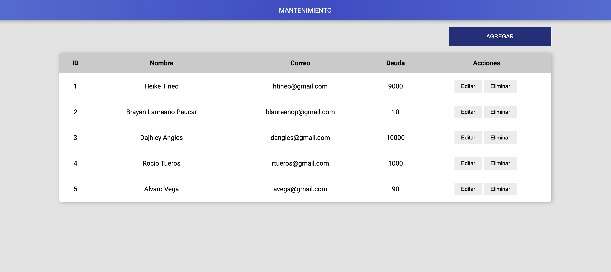

# Proyecto Test Expertia
El requerimiento era muy genera, implemente un API basico donde registro data de un cliente y para consumirlo por Front solo paso 3 parametros por el tiempo que me dieron para el desarrollo y tampoco se especifico.

- Se implemento un monorepo para tener tanto la API y Front Juntos

### La API se encuentra 

```
cd packages/api
```
### Proyecto Front

```
cd packages/sistema
```

### Screenshots



